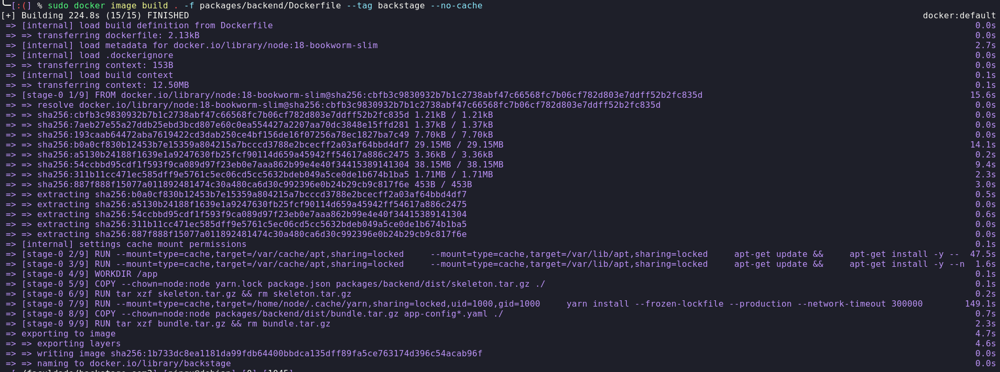
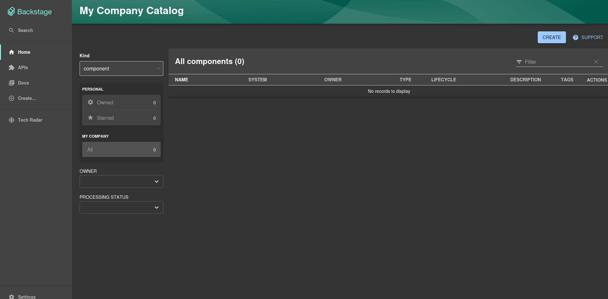

# Ponderada Backstage
## Introdução
O Backstage é uma plataforma de gerenciamento, organização de serviços de organizações. Ele foi feito e é mantido pelo Spotify e é usado por várias empresas para gerenciar seus serviços.

Para essa atividade, deve-se instalar a aplicação do backstage e rodá-la no Docker. 

## Instalação
Para instalar e executar esse serviço, é necessário seguir os passos abaixo:

OBS: É necessário ter o Node.js e o Docker instalados na máquina.

### Crie a aplicação do Backstage:
```bash
npx @backstage/create-app@latest
```
### Instale o Yarn, caso não esteja instalado:
```bash
npm install --global yarn
```
### Após a instalação do Yarn, navegue até o diretório da aplicação e instale as dependências:
```bash
yarn install
yarn dev
```

## Configurações adicionais

Para a possibilidade de utilizar o backstage como guest, é necessário adicionar a seguinte linha no arquivo `app-config.production.yaml`:
```yaml
  auth:
    providers:
      guest:
        dangerouslyAllowOutsideDevelopment: true
```

## Setup Docker: Backend

Após os passos acima, vamos executar o backstage no Docker. Primeiro vamos fazer o setup do backend:

### Geração de chave de autenticação
```bash
openssl rand -base64 32
```
Após criar a chave, ela será usada para autenticação no backend. Será necessário alterar o arquivo `app-config.production.yaml`:

```yaml
  auth:
    keys:
      - secret: ${YOUR_KEY}
```


### Criação de rede Docker
Devemos criar uma rede Docker para que o backend, frontend e banco de dados possam se comunicar:
```bash
docker network create backstage
```
### Criar imagem postgres
Antes de tudo, vamos criar uma imagem do postgres para ser usada no Docker, substituindo `${ID_DOCKER_NETWORK}` pelo ID da rede criada anteriormente:
```bash
docker run --name postgres -p 5432:5432 -e POSTGRES_PASSWORD=password --net ${ID_DOCKER_NETWORK} -d postgres
```
### Build da imagem do backstage
Para criar a imagem do backstage, execute o seguinte comando:
```bash
  $ docker image build . -f packages/backend/Dockerfile --tag backstage --no-cache
```


### Rodar imagem do backstage
Para rodar a imagem do backstage, execute o seguinte comando:
```bash
docker run -it -p 7007:7007 --net ${ID_DOCKER_NETWORK} -e POSTGRES_HOST=postgres -e POSTGRES_PORT=5432 -e POSTGRES_USER=postgres -e POSTGRES_PASSWORD=password backstage
```
Não se esqueça de substituir `${ID_DOCKER_NETWORK}` pelo ID da rede criada anteriormente.

## Setup Docker: Frontend

O frontend utilizará o serviço do Nginx, que será responsável por servir a aplicação do backstage. Para isso, cole o código abaixo em um novo arquivo na raíz do projeto, chamado `default.conf.template`:

```nginx
  server {
    listen       $PORT;
    server_name  localhost;

    #charset koi8-r;
    #access_log  /var/log/nginx/host.access.log  main;

    location / {
        include /etc/nginx/mime.types;
        root   /usr/share/nginx/html;
        index  index.html index.htm;
        try_files $uri /index.html;
    }

    location /healthcheck {
        return 204;
    }

    #error_page  404              /404.html;

    # redirect server error pages to the static page /50x.html
    #
    error_page   500 502 503 504  /50x.html;
    location = /50x.html {
        root   /usr/share/nginx/html;
    }
}
``` 

### Leitura de variáveis de ambiante

Agora, devemos criar um script que irá ler as variáveis de ambiente e substituir no arquivo `default.conf.template`. Crie um arquivo chamado `inject-config.sh` e cole o seguinte código:

```bash
#!/bin/sh
  set -Eeuo pipefail

  function inject_config() {
    # Read runtime config from env in the same way as the @backstage/config-loader package
    local config
    config="$(jq -n 'env |
      with_entries(select(.key | startswith("APP_CONFIG_")) | .key |= sub("APP_CONFIG_"; "")) |
      to_entries |
      reduce .[] as $item (
        {}; setpath($item.key | split("_"); $item.value | try fromjson catch $item.value)
  )')"

  >&2 echo "Runtime app config: $config"

  local main_js
  if ! main_js="$(grep -l __APP_INJECTED_RUNTIME_CONFIG__ /usr/share/nginx/html/static/*.js)"; then
    echo "Runtime config already written"
    return
  fi
  echo "Writing runtime config to ${main_js}"

  # escape ' and " twice, for both sed and json
  local config_escaped_1
  config_escaped_1="$(echo "$config" | jq -cM . | sed -e 's/[\\"'\'']/\\&/g')"
  # escape / and & for sed
  local config_escaped_2
  config_escaped_2="$(echo "$config_escaped_1" | sed -e 's/[\/&]/\\&/g')"

  # Replace __APP_INJECTED_RUNTIME_CONFIG__ in the main chunk with the runtime config
  sed -e "s/__APP_INJECTED_RUNTIME_CONFIG__/$config_escaped_2/" -i "$main_js"
}

inject_config
```
### Dockerfile do frontend
Agora que fizemos os arquivo de configuração, vamos criar o Dockerfile do frontend. Crie um arquivo chamado `Dockerfile.hostbuild` e cole o seguinte código:

```Dockerfile
  FROM nginx:mainline

  RUN apt-get update && apt-get -y install jq && rm -rf /var/lib/apt/lists/*

  COPY packages/app/dist /usr/share/nginx/html
  COPY docker/default.conf.template /etc/nginx/templates/default.conf.template

  COPY docker/inject-config.sh /docker-entrypoint.d/40-inject-config.sh

  ENV PORT 80
```

### Faça build do frontend
Para fazer o build do frontend, execute o seguinte comando:
```bash
yarn workspace app build --config ../../app-config.yaml
```

### Build da imagem do frontend
Para criar a imagem do frontend, execute o seguinte comando:
```bash
docker build -t backstage-frontend -f Dockerfile.hostbuild . 
```
### Executar imagem do frontend
Para rodar a imagem do frontend, execute o seguinte comando,
substituindo `${ID_DOCKER_NETWORK}` pelo ID da nossa rede:
```bash
docker run -p 3000:80 --network ${ID_DOCKER_NETWORK} backstage-frontend
```

## Visualização da aplicação
Após tudo isso, acesse a url `http://localhost:3000/` no seu navegador.



## Conclusão
Após essa atividade, foi possível entender como funciona o backstage e como ele é utilizado, além da sua importância para a organização de serviços de uma empresa. 